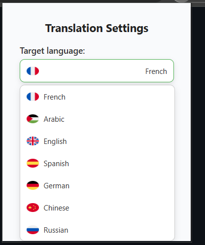
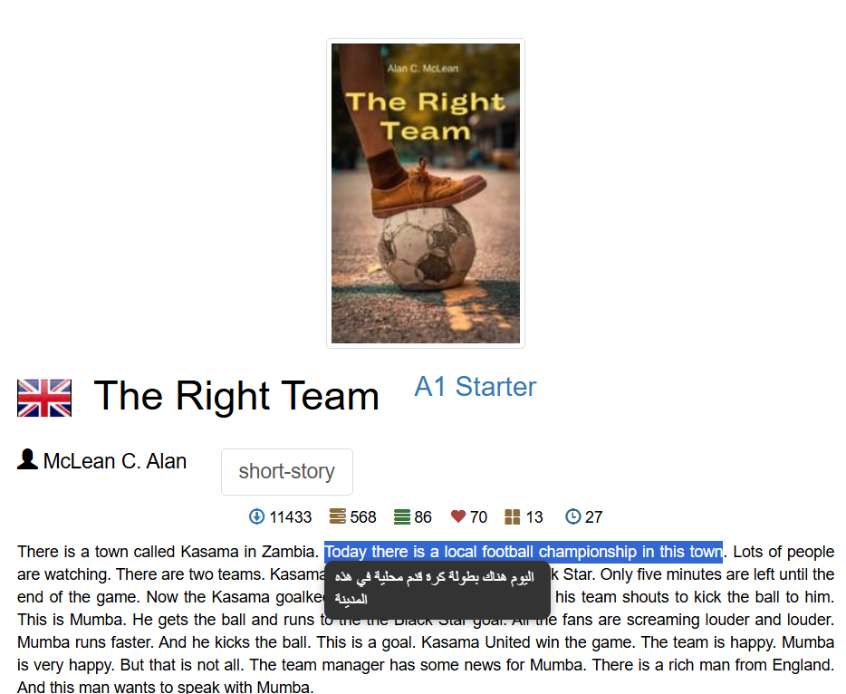

# 🌍 Chrome Translator Extension

A simple and lightweight Chrome extension that lets you **select text on any webpage** and instantly see the **translation in your chosen language** (via Google Translate API).

---

## 🚀 Features
- 🔍 Select any text on a webpage → see instant translation in a tooltip.
- 🌐 Choose your target language from the popup (with emoji flags).
- ⚡ Fast and lightweight (no external dependencies).
- 🖥 Works on all websites.

---

## 📸 Screenshots

### MZ translator


### English - Arabic 


### English - Frensh


---

## 🛠 Installation

### From source (Developer mode)
1. Clone this repository:
   ```bash
   git clone https://github.com/AkazaSama1213/MZ-Translate
2. Open Chrome and go to chrome://extensions/.

3. Enable Developer Mode (top-right).

4. Click Load unpacked and select the project folder.

Done ✅ The extension should now appear in your toolbar.

## 🤝 Contributing

Contributions, issues and feature requests are welcome!

## ❤️ Support

If you like this project, consider giving it a ⭐ on GitHub!
